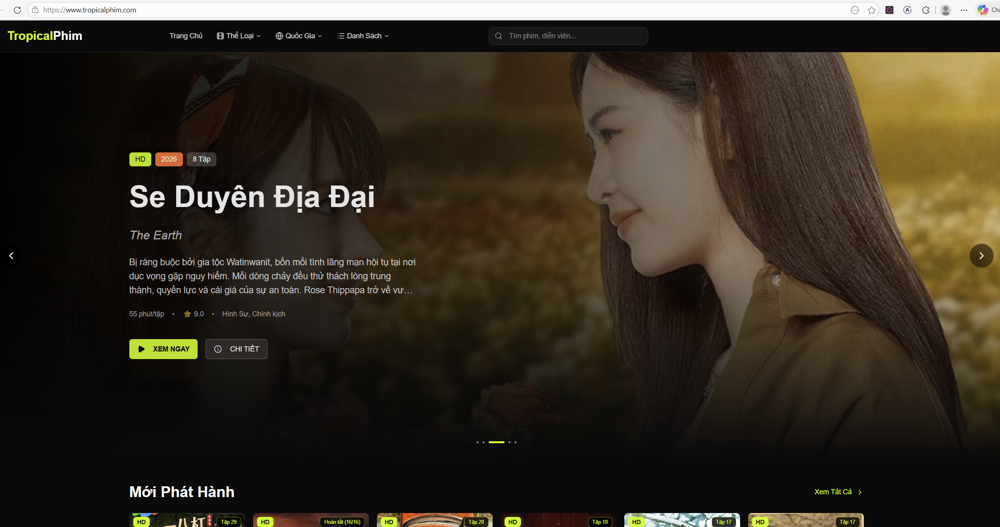
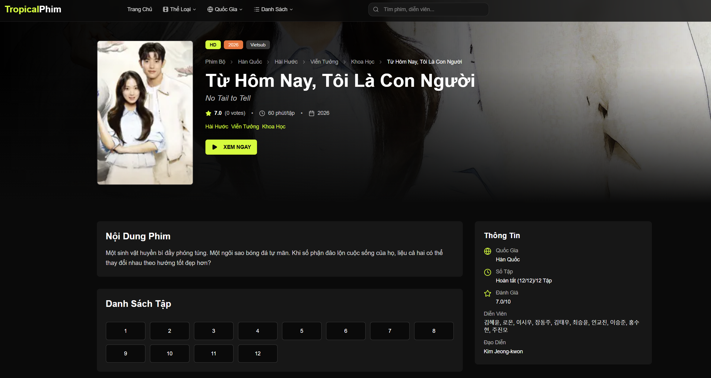
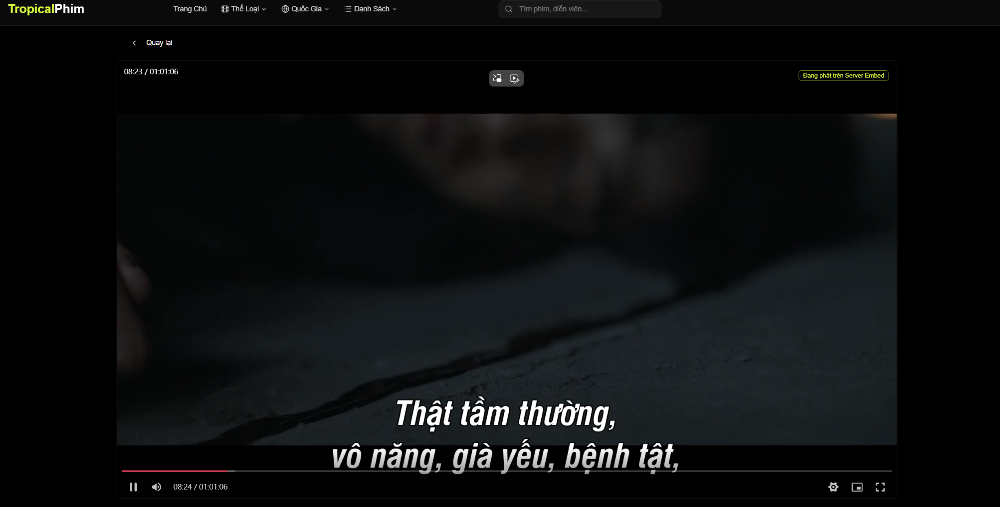

# TropicalPhim

A modern movie streaming application built with [Next.js](https://nextjs.org) and [React](https://react.dev). TropicalPhim provides users with a seamless experience to browse, search, and watch movies and TV series with features like filtering, detailed movie information, episode management, and video playback.

## Features

- **Movie & Series Browsing**: Browse extensive catalog of movies and TV series
- **Search Functionality**: Advanced search to find movies and series easily
- **Filtering**: Filter content by genre and other criteria
- **Movie Details**: Detailed information with tabs for overview, cast, and more
- **Episode Management**: Watch episodes with organized episode listings
- **Video Player**: Built-in video player for streaming content
- **Responsive Design**: Mobile-friendly interface with responsive navigation
- **Hero Slider**: Featured content showcase on the homepage
- **Continue Watching**: Resume watching from where you left off
- **Share Functionality**: Share movies and series with others

## Tech Stack

- **Framework**: [Next.js](https://nextjs.org) with TypeScript
- **Styling**: Tailwind CSS
- **UI Components**: Custom component library with shadcn/ui components
- **Video Streaming**: Integration with Ophim API

## License

Copyright © 2026 Kanenguyen03. All rights reserved.

This project is provided as-is for personal use. Unauthorized copying or distribution is prohibited.
